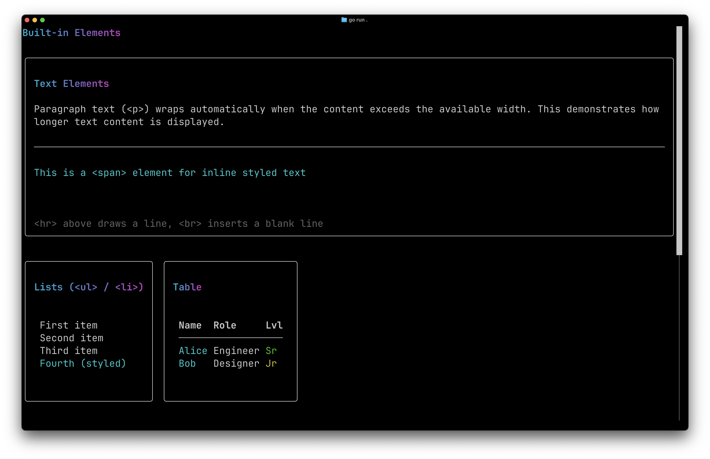

# Elements

Showcases the built-in HTML-like elements (`<div>`, `<span>`, `<button>`, `<input>`, `<table>`, `<progress>`, `<hr>`, and more) with their default behaviors and attributes.

## Screenshot



## Run

```bash
go run .
```

## Guide

For a detailed walkthrough, see the [Elements guide](https://go-tui.dev/guide/elements).
