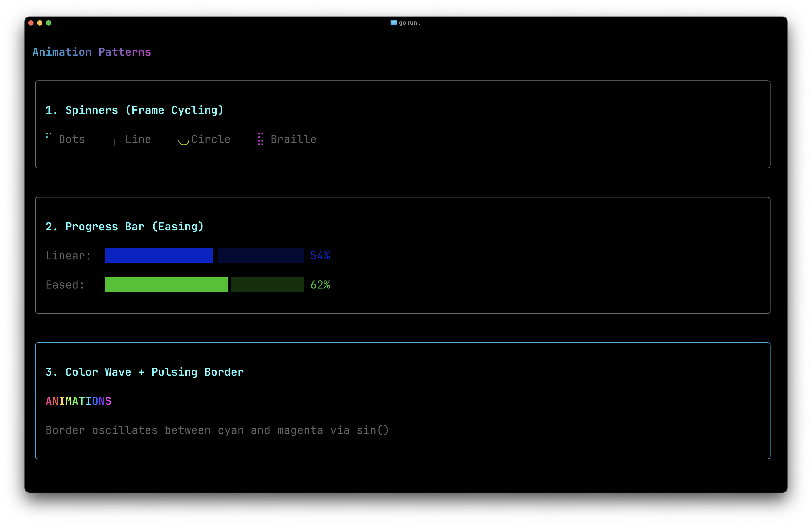

# Animation

Demonstrates four terminal animation patterns: frame-cycling spinners, eased progress bars with fractional block characters, a per-character HSL color wave, and a pulsing border using gradient interpolation. All driven by a single 60fps timer.

## Screenshot



## Run

```bash
go run .
```

## Guide

For a detailed walkthrough, see the [Animation guide](https://go-tui.dev/guide/animation).
