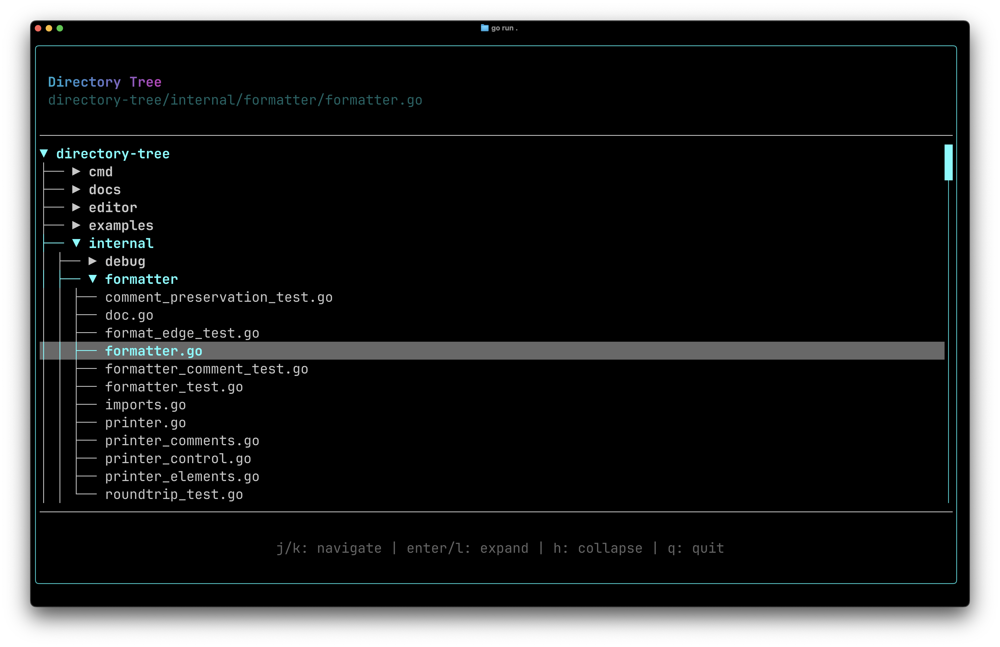

# Directory Tree

A foldable, keyboard-driven directory tree explorer with lazy child loading, scroll-to-cursor behavior, and ancestor path highlighting. Uses reactive state for the cursor, expanded map, and scroll position, with a watcher to keep the cursor visible as you navigate.



See the full [Directory Tree guide](https://www.go-tui.dev/guide/directory-tree) for a walkthrough of the implementation.

## Run

```bash
go run . [path]
```

If no path is given, the current directory is used.
